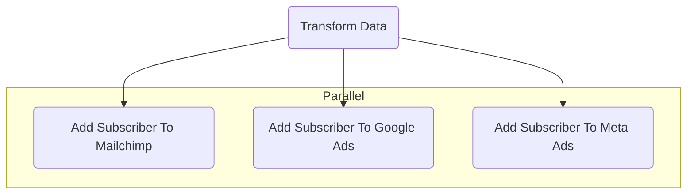

# Customer to Audiences Workflow Example

The Workflow in this project simulates Customers being pushed to marketing channels, Mailchimp, Google Ads, Meta Ads.

## How it works?

### High-level overview

- Listen to Customer created event
- Transform Customer data to fit audience destinations
- Send Customer data to Mailchimp
- Send Customer data to Google Ads
- Send Customer data to Meta Ads
