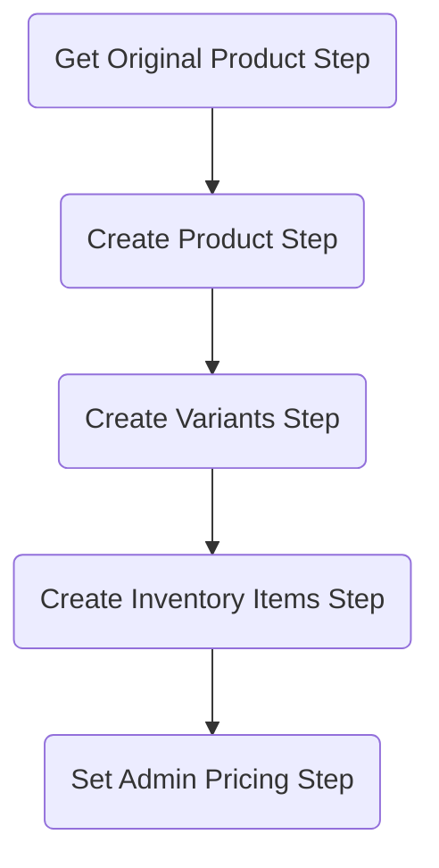

# Duplicate Product Workflow

This example demostrates how to implement a workflow that duplicates a product. The example uses custom Workflows, API Routes, and Admin Widgets.

## Usage

A new widget has been added to the product details page in the admin UI. The widget is located in top right corner of the page, and is a round button with a tool icon. Clicking the button will reveal a dropdown menu with a single option, "Duplicate".

Clicking the option will open a drawer with a form. The form allows the user to specify a new name for the duplicated product, as well as selecting which attributes to copy from the original product. The form also allows the user to specify whether the duplicated product should be published immediately, or be created in draft state.

Once the form is submitted, the workflow will be triggered. The user will be notified of the success or failure of the workflow through a toast notification. On success, the user will be redirected to the details page of the duplicated product.

## How it works

## Workflow

The following steps are performed in the [Workflow](src/workflows/duplicate-product/index.ts):

**Retrieving the original product**

The original product is retrieved from the database using the `id` provided in the `input` object.

See [get-original-product-step.ts](src/workflows/duplicate-product/steps/get-original-product-step.ts).

**Creating the new product**

A new product is created with the attributes of the original product that have been specified in the admin Widget, as well as the new name.

The compensation handler ensures that the new product is deleted if the workflow fails.

See [create-product-step.ts](src/workflows/duplicate-product/steps/create-product-step.ts).

**Duplicating the variants**

The original product's variants are duplicated and assigned to the new product. The step strips the variants' of all attributes that have a unique constraint. The new variants are assigned to the new product.

The compensation handler ensures that the new product's variants are deleted if the workflow fails.

See [create-variants-step.ts](src/workflows/duplicate-product/steps/create-variants-step.ts).

**Creating inventory items**

> This step is a no-op if the Inventory Module is not installed, or the original products inventory is not managed in Medusa.

Inventory items are generated and attached to the new product's variants.

The compensation handler ensures that the new product's variants' inventory items are deleted if the workflow fails.

See [create-inventory-items-step.ts](src/workflows/duplicate-product/steps/create-inventory-items-step.ts).

**Decorating the new product**

The new product is retrieved and decorated with admin pricing data. The product is then returned to the user.

See [set-admin-pricing-step.ts](src/workflows/duplicate-product/steps/set-admin-pricing-step.ts).
