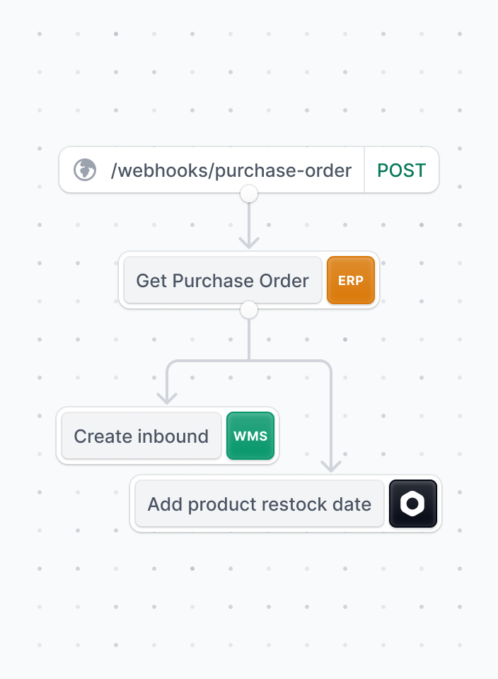
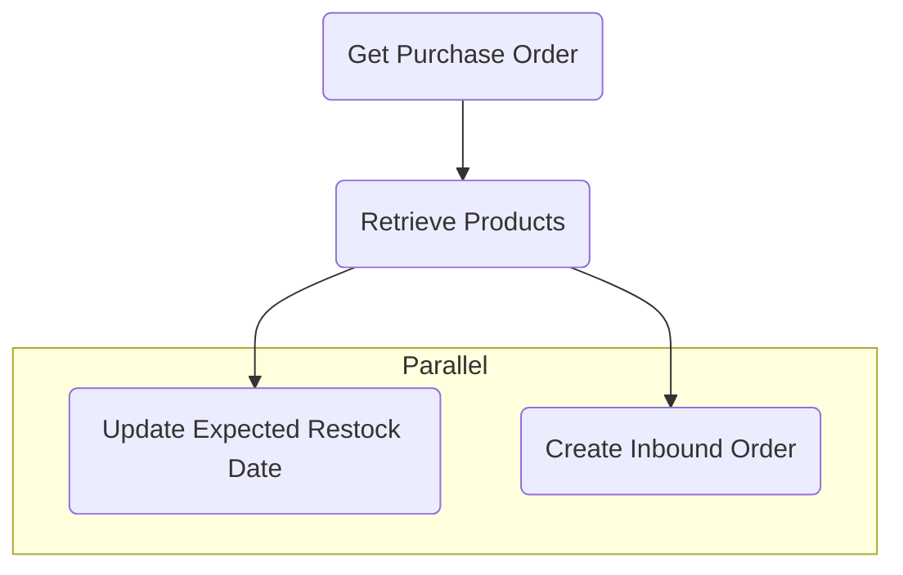

# ERP to WMS Workflow Example

The Workflow in this project simulates a Purchase Order flow between an ERP (Enterprise Resource Planning) system and a WMS (Warehouse Management System).

<div align="center">

</div>

## Prerequisites

Before you begin, ensure you have created a Postgres database with name `erp-to-wms-workflow` and a `.env` file with the following variable:

```
POSTGRES_URL=postgres://localhost/erp-to-wms-workflow
```

## Getting started

To set up the project, run the following commands:

```
npm install
npm run build
npx @medusajs/medusa-cli@latest migrations run
npm run seed
npm run dev
```

## How it works?



### High-level overview

- A Purchase Order is created in the ERP
- Medusa receives a webhook event from the ERP
- Our Workflow is executed
- Products in Medusa are updated with expected restock date
- Purchase Order is pushed to the WMS
- WMS creates an Inbound Order

## Workflow

The following steps are performed in the Workflow.

See [`/src/workflows/purchase-order.ts`](/erp-to-wms/src/workflows/purchase-order.ts).

**Retrieve Purchase Order**

The Purchase Order is retrieved using the `ErpService` ([`/src/services/erp.ts`](/erp-to-wms/src/services/erp.ts)). This service returns a mock Purchase Order. In a real-world scenario, this service would interact with your ERP to retrieve the Purchase Order.

See [`src/steps/get-purchase-order.ts`](/erp-to-wms/src/steps/get-purchase-order.ts).

**Retrieve Products**

The Purchase Order contains order lines, that each has a reference to a Product in Medusa. After retrieving the Purchase Order, we fetch the Products from Medusa using our [Product Module](https://docs.medusajs.com/experimental/product/overview).

See [`src/steps/get-products.ts`](/erp-to-wms/src/steps/get-purchase-order.ts).

**Extract expected restock date from Purchase Order**

The Purchase Order from the ERP comes with an expected restock date for the order lines.

We want to use this property in a subsequent step, so we extract it from the Purchase Order using an inline [transformer](https://docs.medusajs.com/references/workflows/transform):

```ts
createWorkflow("confirm-purchase-order", function (input) {
  ...
  const expectedRestockDate = transform({ purchaseOrder }, ({ purchaseOrder }) => purchaseOrder.expected_restock)
  ...
```

See [`src/workflows/purchase-order.ts`](/erp-to-wms/src/workflows/purchase-order.ts).

**Transform Purchase Order to fits the shape of order in WMS**

Integrating two systems typically requires you two map the shape of resources between them.

For example, a Product in Medusa takes a different shape than an Order Line in the ERP.

We use a [transformer](https://docs.medusajs.com/references/workflows/transform) to transform the Purchase Order to fit the format expected by the WMS.

```ts
export const transformPoToWMS = ({ purchaseOrder }): WmsOrder => {
  return {
    metadata: {
      purchase_order_id: purchaseOrder.id,
    },
    order_lines: purchaseOrder.lines.map((l) => l.line_id),
  };
};

createWorkflow("confirm-purchase-order", function (input) {
  ...
  const wmsOrder = transform({ purchaseOrder }, transformPoToWMS);
  ...
})
```

See [`src/transformers/purchase-order-to-wms.ts`](/erp-to-wms/src/transformers/purchase-order-to-wms.ts).

**Update Products with the expected restock date and Create Inbound Order in WMS**

Finally, we update the metadata of the Products in Medusa with the expected restock date (extracted previously) using our Product Module.

This information can be useful for several things, such as displaying it to your customer service team in Medusa Admin, or showing it on the product detail pages on your webshop.

Additionally, we create an Inbound Order in the WMS using the `WmsService` ([`src/services/wms.ts`](/erp-to-wms/src/services/wms.ts)). Similar to the ERP service, this service would communicate with your WMS in a real-world scenario. In our example, we return a dummy response.

These two actions happen in [parallel](https://docs.medusajs.com/references/workflows/parallelize):

```ts
createWorkflow("confirm-purchase-order", function (input) {
  ...
  parallelize(
    steps.updateExpectedRestockDate({ expectedRestockDate, products }),
    steps.createInboundOrder({ wmsOrder })
  );
  ...
})
```

See `src/steps/update-restock-date.ts` and `src/steps/create-inbound-order.ts`.

### Executing the workflow

The Workflow is executed by a webhook created using our API Routes.

See [`src/api/webhooks/purchase-order/route.ts`](/erp-to-wms/src/api/webhooks/purchase-order/route.ts).

Upon receiving the webhook event from the ERP, the Workflow is executed and potential errors are handled:

```ts
...
  const { errors } = await workflow.run({
    input: { purchaseOrderId: "po_12345" },
    throwOnError: false,
  });

  if (errors?.length > 0) {
    const errResponse = errors.map((e) => ({
      step: e.action,
      error: e.error.message,
    }));

    res.json(errResponse).status(500);
  }
  res.json({ message: "success" }).status(200)
  ...
```

## Try it out

To test the Workflow:

- Run `npm run dev`
- Run `curl -v -X POST 'http://localhost:9000/webhooks/purchase-order' | jq`

You should receive a response:

```
{
  "message": "success"
}
```

And in your terminal, you should see the following logs:

```
info:    Processing product.updated which has 0 subscribers
info:    Processing product.updated which has 0 subscribers
```

## Error handling

If an error occurs in one of the steps in your Workflow, the built-in rollback mechanism will kick in. Each step can have a defined compensation action to revert its changes if the workflow fails in a subsequent step.

Learn more about compensation actions in [our documentation](https://docs.medusajs.com/development/workflows/#add-error-handling).

Our Workflow performs compensating actions for two steps:

- Products updated with an expected restock date
- Inbound Order created in WMS

You can explore the compensation actions in [`src/steps/update-restock-date.ts`](/erp-to-wms/src/steps/update-restock-date.ts) and [`src/steps/create-inbound-order.ts`](/erp-to-wms/src/steps/create-inbound-order.ts).

To test the compensating flow, uncomment the error step in the Workflow:

```ts
createStep("mock-error-step", async function (input: any, context) {
  throw new Error(
    "This is meant to be a demonstration of compensating actions"
  );
})({});
```

When you run the workflow again, you should receive a response:

```
[
  {
    "step": "mock-error-step",
    "error": "This is meant to be a demonstration of compensating actions"
  }
]
```

This is the error returned in the API Route (webhook).

And in your terminal, you should see the following logs:

```
Rolling back expected restock date on Products
Rolling back inbound order
```
