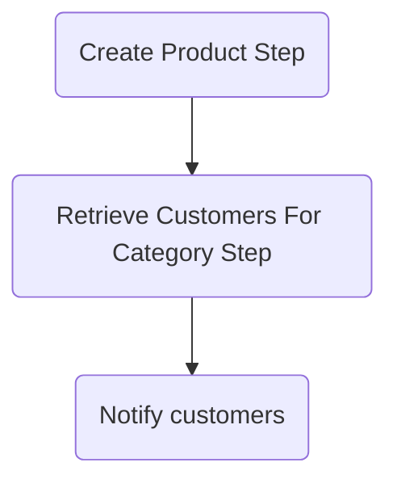

# Notify customers on PIM import workflow example

The Workflow in this project simulates an import flow of products from PIM (Product Information Management) system to Medusa. Upon product import, an email is sent to customers who buy from that category about a new product.

## Prerequisites

Before you begin, ensure you have created a Postgres database with name `medusa-store` and a `.env` file with the following variable:

```
POSTGRES_URL=postgres://localhost/medusa-store
```

## Getting started

To set up the project, run the following commands:

```
npm install
npm run build
npx @medusajs/medusa-cli@latest migrations run
npm run dev
```

## How it works?




### High-level overview

- A import is triggered via HTTP POST call
- Medusa receives a webhook event from the PIM
- Our Workflow is executed
- Products in Medusa are created using product module
- Email is sent to users who purchase products from the same category

## Workflow

The following steps are performed in the Workflow.

See [`src/workflows/pim-import.ts`](/notify-category-customers/src/workflows/pim-import.ts).

**Create Product**

The products are created in Medusa.

See [`src/workflows/steps/create-product.ts`](/notify-category-customers/src/workflows/steps/create-product.ts).

After we create products, we will need category ids for the subsequent steps so we extract them using inline transformer:

````ts
const categoryIds = transform({ products }, ({ products }) =>
  products.flatMap((p) => p.categories.map((c) => c.id))
);
````

**Get customers from product category**

Once products are created, we retrieve customers who bought products from that category previously. 

See [`src/workflows/steps/get-customers-for-product-category.ts`](/notify-category-customers/src/workflows/steps/get-customers-for-product-category.ts).

**Notify Active Cart Customers**

Send an email via email mock service to notify customers about the new product in the category.

See [`src/workflows/steps/notify-customers.ts`](/notify-category-customers/src/workflows/steps/notify-customers.ts).

### Executing the workflow

The Workflow is executed by a webhook created using our API Routes.

See [`src/api/products/route.ts`](/notify-category-customers/src/api/products/route.ts).

Upon receiving the webhook event from PIM, the Workflow is executed:

```ts
// ...
const products = await pimWorkflow.run({
    input: { productData: req.body },
    context: { manager },
});
res.send(products.result);
// ...
```

## Try it out

To test the Workflow:

- Run `npm run dev`
- Run `curl --location --request POST 'http://localhost:9000/products' \
  --header 'Content-Type: application/json' \
  --data-raw '[{
  "title": "Test product 12",
  "description": "Very nice special product",
  "categories": [{"id": "pcat_merch"}]
  },
  {
  "title": "Test product 22",
  "description": "Very nice special product",
  "categories": [{"id": "pcat_merch"}]
  }]'`

You should receive a response with an array of created products in Medusa.
