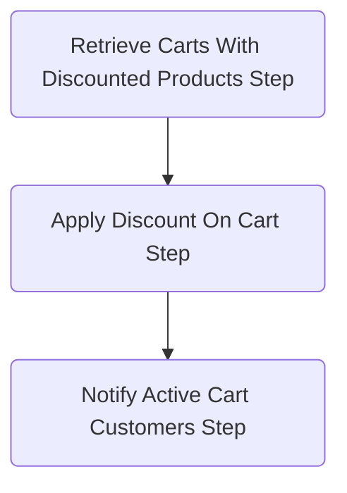

# Notify customers about discounted product - workflow example

A demo project containing a workflow for automatically applying newly created discount on uncompleted carts containing discounted products and notifying users about the discount.

## Prerequisites

Before you begin, ensure you have created a Postgres database with name `medusa-store` and a `.env` file with the following variable:

```
POSTGRES_URL=postgres://localhost/medusa-store
```

## Getting started

To set up the project, run the following commands:

```
npm install
npm run build
npx @medusajs/medusa-cli@latest migrations run
npm run seed
npm run dev
```

## How it works?


### High-level overview

- A Discount is created in Medusa
- Event subscriber listening for Discount Created event is called
- Our Workflow is executed
- Uncompleted carts which have newly discounted products are discounted
- Email is send to customers

## Workflow

The following steps are performed in the Workflow.

**Retrieve Carts With Discounted Products Step**

The carts containing newly discounted products are retrieved using the Medusa cart service.

See [`/src/workflows/notify-on-discount.ts`](/notify-on-discount/src/workflows/notify-on-discount.ts).

**Apply Discount On Cart Step**

Apply new discount on the carts retrieved in the previous step.

See [`src/steps/apply-discount-on-cart-step.ts`](notify-on-discount/src/workflows/steps/apply-discount-on-cart-step.ts).

**Notify Active Cart Customers**

Send an email via email mock service to notify customers about the change in their cart.

See [`src/steps/notify-active-cart-customers.ts`](notify-on-discount/src/workflows/steps/notify-active-cart-customers.ts).

### Executing the workflow

The Workflow is executed by a subscriber.

See [`src/subscribers/product-dicsount-created.ts`](notify-on-discount/src/subscribers/product-dicsount-created.ts).

Upon receiving the discount created event, the Workflow is executed and potential errors are handled:

```ts
// ...
const workflow = notifyOnDiscountWorkflow(container);
await workflow.run({
    input: {
        discountCode: discount.code,
        discountedProductIds: products.map((p) => p.id),
    },
});
//...
```

## Try it out

To test the Workflow:

- Run `npm run dev`
- Create a cart with a product in Medusa store
- Create a discount for that product in Medusa admin

After discount is created, in your terminal, you should see a log about :

## Error handling

If an error occurs in one of the steps in your Workflow, the built-in rollback mechanism will kick in. Each step can have a defined compensation action to revert its changes if the workflow fails in a subsequent step.

Learn more about compensation actions in [our documentation](https://docs.medusajs.com/development/workflows/#add-error-handling).

Our Workflow performs compensating actions for:

- Applying Discount on Cart step
  - in case one of the following steps fail, discount will be removed from the carts

You can explore the compensation actions in [`src/workflows/steps/apply-discount-on-cart-step.ts`](notify-on-discount/src/workflows/steps/apply-discount-on-cart-step.ts).

