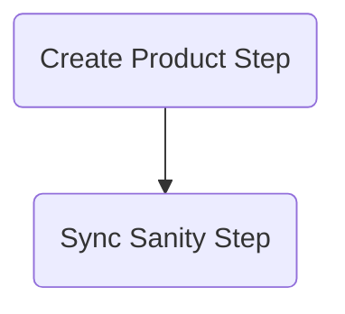

# PIM to Sanity sync workflow example

The Workflow in this project simulates an import flow between an PIM (Product Information Management) system and a Sanity CMS.

## Prerequisites

Before you begin, ensure you have created a Postgres database with name `medusa-store` and a `.env` file with the following variable:

Also make sure you've [created Sanity account](https://www.sanity.io/docs/getting-started-with-sanity) and have created access token via Sanity dashboard. 

```
POSTGRES_URL=postgres://localhost/medusa-store
SANITY_SECRET_TOKEN= <<your_sanity_token>>
```

## Getting started

To set up the project, run the following commands:

```
npm install
npm run build
npx @medusajs/medusa-cli@latest migrations run
npm run dev
```

## How it works?




### High-level overview

- A import is triggered via HTTP POST call
- Medusa receives a webhook event from the PIM
- Our Workflow is executed
- Products in Medusa are created using product module
- Records are created in the Sanity CMS

## Workflow

The following steps are performed in the Workflow.

See [`src/workflows/pim-import.ts`](/pim-medusa-sanity/src/workflows/pim-import.ts).

**Create Product**

The products are created using [Medusa Product Module](https://docs.medusajs.com/experimental/product/overview). This will create the products in Medusa.

See [`src/workflows/steps/create-product.ts`](/pim-medusa-sanity/src/workflows/steps/create-product.ts).

**Sync Sanity**

After creating the products in Medusa, we create corresponding records in Sanity using the client.

See [`src/workflows/steps/sync-sanity.ts`](/pim-medusa-sanity/src/workflows/steps/sync-sanity.ts).

### Executing the workflow

The Workflow is executed by a webhook created using our API Routes.

See [`src/api/products/route.ts`](/pim-medusa-sanity/src/api/products/route.ts).

Upon receiving the webhook event from PIM, the Workflow is executed:

```ts
// ...
const products = await pimWorkflow.run({
    input: { productData: req.body },
    context: { manager },
});
res.send(products.result);
// ...
```

## Try it out

To test the Workflow:

- Run `npm run dev`
- Run `curl --location --request POST 'http://localhost:9000/products' \
  --header 'Content-Type: application/json' \
  --data-raw '[{
  "title": "Test product 1",
  "description": "Product 1 description"
  },
  {
  "title": "Test product 2",
  "description": "Product 2 description"
  }]'`

You should receive a response with an array of created products in Medusa.

## Error handling

If an error occurs in one of the steps in your Workflow, the built-in rollback mechanism will kick in. Each step can have a defined compensation action to revert its changes if the workflow fails in a subsequent step.

Learn more about compensation actions in [our documentation](https://docs.medusajs.com/development/workflows/#add-error-handling).

Our Workflow performs compensating actions for two steps:

- Products created in medusa
  - created products will be deleted for compensation
- Records created in Sanity
  - created records will be deleted for compensation

You can explore the compensation actions in [`src/workflows/steps/create-product.ts`](/pim-medusa-sanity/src/workflows/steps/create-product.ts).

