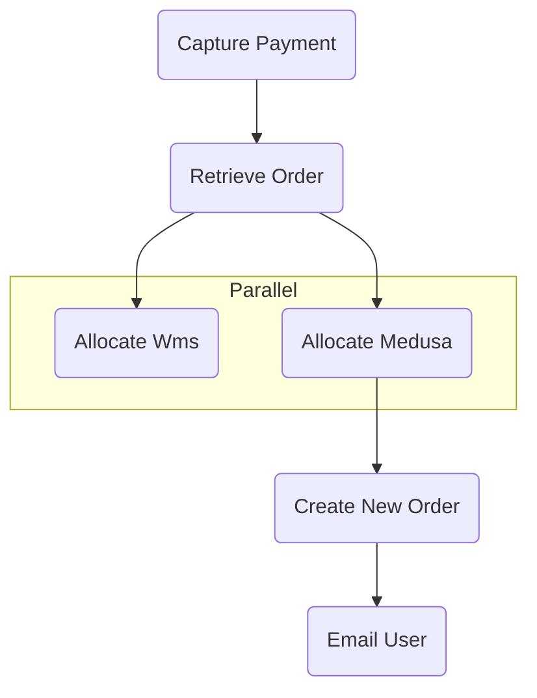

# Subscription Workflow

The Subscription Workflow example simulates a webhook handler that process an order that the user has subscribed to and will be placed every month for example.
Following there is a brief description of each step in the order they occur in the workflow:

#### capturePayment:

Invoke: Captures the payment details from the input. In this example we assume Stripe subscription is being used and the payment was already captured.
Compensation: Refunds the payment using the paymentService if necessary.

#### retrieveOrder:

Invoke: Retrieves an order based on the order_id from the input using the orderService.
Compensation: Not specified in this step.

#### allocateStockWms \*

Invoke: Allocates stock from WMS (Warehouse Management System) based on the order details.

Compensation: Frees up the allocated stock in WMS if needed.

#### allocateStockMedusa \*

Invoke: Allocates stock from Medusa (presumably another inventory system) based on the items.

Compensation: Frees up the allocated stock in Medusa if needed.

##### \* executed in parallel:

#### createNewOrder:

Invoke: Creates a new order with the given items using the orderService.
Compensation: Deletes the newly created order if necessary.

#### emailUser:

Invoke: Sends an email to the user with the payment, order, and user details.
Compensation: Not specified in this step.

## Simulated Failures

- Inventory Service (allocateStockMedusa step):
  The inventory service for Medusa has a 20% chance of failing to allocate stock.

- WMS Service (allocateStockWms step):
  The WMS (Warehouse Management System) service has a 20% chance of failing to
  allocate stock.

- Order Service (createNewOrder step):
  The order service has a 10% chance of failing to duplicate an order, as determined by the random number comparison.

- Email Service (emailUser step):
  The email service has a 10% chance of failing to send an email.

These failure rates are artificially introduced for simulation purposes.
